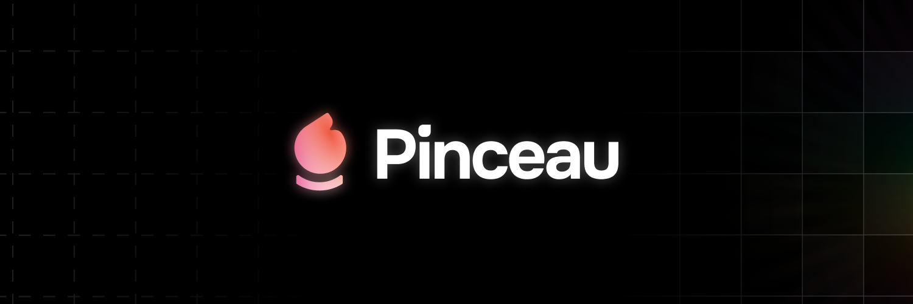

# Pinceau [](https://www.npmjs.com/package/@pinceau/core)

> Make your `<script>` lighter and your `<style>` smarter.

> [🕹️ Try it online](https://play.pinceau.dev) • [📖 Documentation](https://pinceau.dev)

- 🪄 Fully-typed styling API inspired from the tools you already [_love_](https://stitches.dev)
  - `$styled.el()`, `styled()` and `css()`

- 🎨 Multi-layers [Design Tokens compatible](https://github.com/design-tokens/community-group) theming

- ⚡ Plug & play support for any [Vite](https://vitejs.dev)-based framework:
  - [Vue](./integrations/vue), [React](./integrations/vue), [Svelte](./integrations/vue), [Nuxt](./integrations/nuxt), [Astro](./integrations/astro)
  - Planned support for: [Qwik](https://qwik.builder.io), [SolidJS](https://www.solidjs.com), [Preact](https://preactjs.com), [Lit](https://lit.dev), [_yours ?_](https://github.com/Tahul/pinceau/issues)

- 💅 Comes with everything you need to build a robust design system:
  - Smart output engine that uses [static CSS](https://developer.mozilla.org/en-US/docs/Web/CSS) or [CSSOM](https://developer.mozilla.org/en-US/docs/Web/API/CSS_Object_Model) when you need it
  - Style colocation
  - Style composition
  - Responsive variants API
  - Theming tokens
  - Runtime theme swapping

- 🌐 SSR-ready with optimized hydration and no _JS/CSS_ theme duplication

- ✅ **300+** tests covering every core packages and integrations

- 🍦 [Pinceau VSCode extension](https://marketplace.visualstudio.com/items?itemName=yaelguilloux.pinceau-vscode) for **DX Sugar**

## ⚙️ Install

<details>
<summary>Vue</summary><br>

```bash
pnpm install @pinceau/vue
```

```ts
// vite.config.ts
import Pinceau from '@pinceau/vue/plugin'

export default defineConfig({
  plugins: [
    Pinceau(),
    ...yourPlugins
  ],
})
```

Example: [`examples/vite-vue/vite.config.ts`](./examples/vite-vue/vite.config.ts)

</details>

<details>
<summary>Svelte</summary><br>

```bash
pnpm install @pinceau/svelte
```

```ts
// vite.config.ts
import Pinceau from '@pinceau/svelte/plugin'

export default defineConfig({
  plugins: [
    Pinceau(),
    ...yourPlugins
  ],
})
```

Example: [`examples/vite-svelte/vite.config.ts`](./examples/vite-svelte/vite.config.ts)

</details>

<details>
<summary>React</summary><br>

```bash
pnpm install @pinceau/react
```

```ts
// vite.config.ts
import Pinceau from '@pinceau/react/plugin'

export default defineConfig({
  plugins: [
    Pinceau(),
    ...yourPlugins
  ],
})
```

Example: [`examples/vite-react/vite.config.ts`](./examples/vite-react/vite.config.ts)

</details>

<details>
<summary>Use our theme or create yours</summary><br>

Use our default theme, [🎨 Palette](./packages/palette):

```ts
// vite.config.ts
export default defineConfig({
  plugins: [
    Pinceau({
      theme: {
        layers: ['@pinceau/palette']
      }
    })
  ]
})
```

Or build your in `theme.config.ts`:

```ts
// theme.config.ts
import { defineTheme } from '@pinceau/theme'

export default defineTheme({
  // Media queries
  media: {
    mobile: '(min-width: 320px)',
    tablet: '(min-width: 768px)',
    desktop: '(min-width: 1280px)'
  },


  // Some Design tokens
  color: {
    red: {
      1: '#FCDFDA',
      2: '#F48E7C',
      3: '#ED4D31',
      4: '#A0240E',
      5: '#390D05',
    },
    green: {
      1: '#CDF4E5',
      2: '#9AE9CB',
      3: '#36D397',
      4: '#1B7D58',
      5: '#072117',
    }
  },
  space: {
    1: '0.25rem',
    2: '0.5rem',
    3: '0.75rem',
    4: '1rem'
  }

  // Utils properties
  utils: {
    px: (value: PropertyValue<'padding'>) => ({ paddingLeft: value, paddingRight: value }),
    py: (value: PropertyValue<'padding'>) => ({ paddingTop: value, paddingBottom: value })
  }
})
```

Example: [`examples/theme/theme.config.ts`](./playground/theme/theme.config.ts)

</details>

## 💖 Credits

This package takes a lot of inspiration from these amazing projects:

> [Stitches](https://stitches.dev) • [vanilla-extract](https://vanilla-extract.style/) • [unocss](https://github.com/unocss/unocss) • [style-dictionary](https://github.com/amzn/style-dictionary)

## License

[MIT](./LICENSE) License &copy; 2022-PRESENT [Yaël GUILLOUX](https://github.com/Tahul)

---

> _“All you need to paint is a few tools, a little instruction, and a vision in your mind.”_ • Bob Ross
